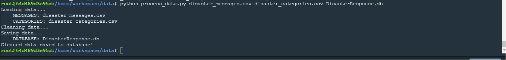
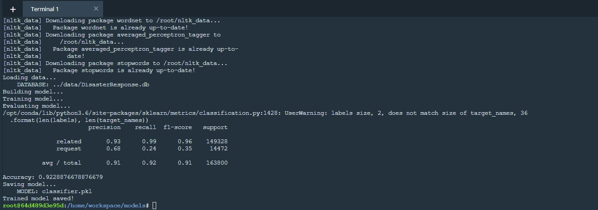
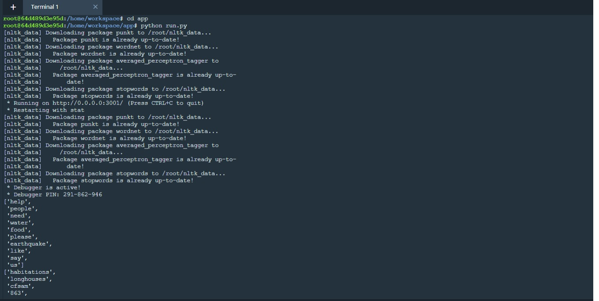
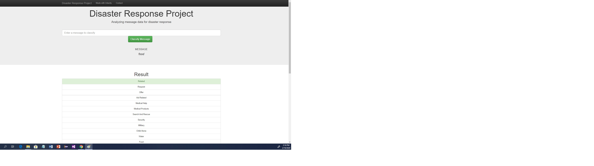
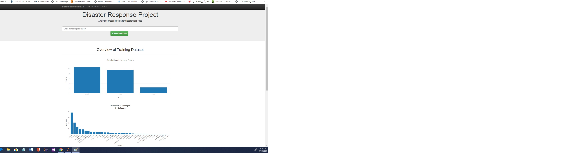
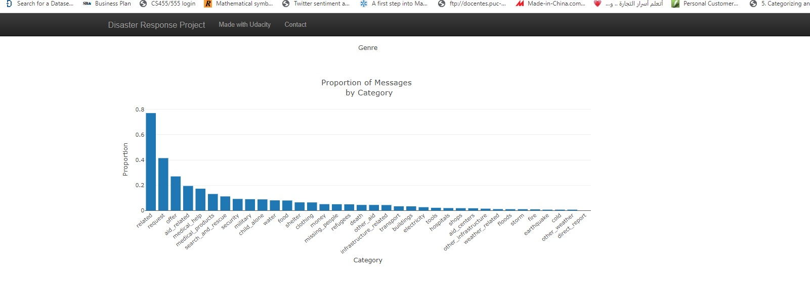

# Disaster-response-pipeline
This project is part of udacity nanodegree
Pleae note that this repository includes the following files:

- app
  - run.py------------------------# FLASK FILE THAT RUNS APP
  -  templates:
     -  go.html-------------------# CLASSIFICATION RESULT PAGE OF WEB APP
     -  master.html---------------# MAIN PAGE OF WEB APP
- data
  - DisasterResponse.db-----------# DATABASE TO SAVE CLEANED DATA TO
  - disaster_categories.csv-------# DATA TO PROCESS
  - disaster_messages.csv---------# DATA TO PROCESS
  - process_data.py---------------# TO PERFORMS ETL PROCESS
- models
  - train_classifier.py-----------# TO CREATE THE MODEL FOR CLASSIFICATION
  - classifier.zip ---------------# THIS IS THE "PKL" FILE AND ZIPPED DUE TO SIZE ISSUE   

### Instructions:
1. Run the following commands in the project's root directory to set up your database and model.

    - To run ETL pipeline that cleans data and stores in database
        `python data/process_data.py data/disaster_messages.csv data/disaster_categories.csv data/DisasterResponse.db`
    - To run ML pipeline that trains classifier and saves
        `python models/train_classifier.py data/DisasterResponse.db models/classifier.pkl`

2. Run the following command in the app's directory to run your web app.
    `python run.py`

3. Go to http://0.0.0.0:3001/

### Please find the below snapshot of the execution

1. Running "process_data.py" file 

2. Running "train_classifier.py" file 

3. Running "run.py" file 

 3.1. Search for text in the web  

 3.2. Displaying messages genres 

 3.3. Proportion of messages by category  

 3.4. Top 10 words occurred 

 3.5. Less 10 words occurred 

